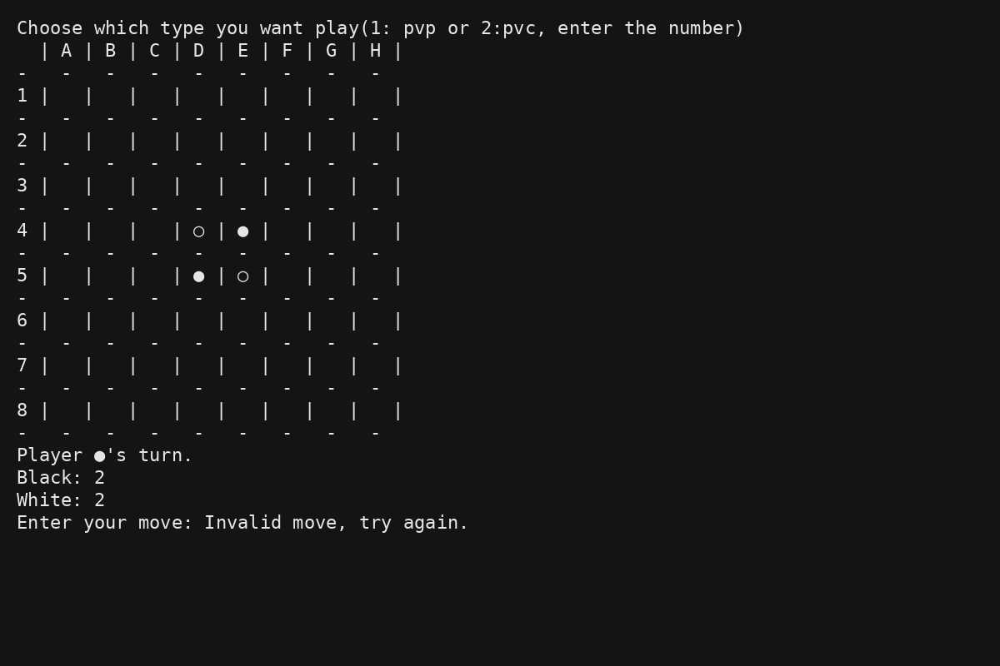

# Othello Game (Java)

---

# Game Screenshot

---

## Table of Contents

- [Project Information](#project-information)
- [Project Description](#project-description)
- [Game Rules](#game-rules)
- [Features Implemented](#features-implemented)
- [Program Structure](#program-structure)
- [How to Run the Program](#how-to-run-the-program)
- [Technologies Used](#technologies-used)
- [Reflection and Learning Outcomes](#reflection-and-learning-outcomes)

---

# Project Information

Course: ICS4U  
Project: Final Programming Project  
Author: Isaac Xu  

This project implements a console-based **Othello (Reversi) board game** using Java.

The game supports both **Player vs Player** and **Player vs Computer** modes.

---

# Project Description

Othello is a classic strategy board game played on an **8×8 board**.

Players take turns placing pieces on the board. If a move surrounds opponent pieces horizontally, vertically, or diagonally, those pieces are flipped to the player's color.

This program recreates the Othello game using **object-oriented programming** and a **console-based interface**.

The program manages:

- the game board
- move validation
- flipping opponent pieces
- switching player turns
- determining the winner

---

# Game Rules

1. The game is played on an **8×8 board**.
2. Two players take turns placing pieces.
3. One player uses **black pieces (●)** and the other uses **white pieces (○)**.
4. A move is valid only if it captures at least one opponent piece.
5. Captured pieces are flipped to the player's color.
6. If a player has no valid moves, their turn is skipped.
7. The game ends when neither player can move.
8. The player with the most pieces wins.

---

# Features Implemented

The program includes the following features:

- 8×8 game board
- Player vs Player mode
- Player vs Computer mode
- Move validation system
- Piece flipping logic
- Score counting
- Turn skipping when no moves exist
- Game end detection
- Winner determination

---

# Program Structure

The project is divided into several Java classes.

| File | Purpose |
|-----|--------|
| Board.java | Manages board state and move validation |
| Player.java | Represents player color and opponent color |
| Othello.java | Controls Player vs Player gameplay |
| Pvc.java | Controls Player vs Computer gameplay |

---

# How to Run the Program

Step 1: Compile the program
javac *.java

Step 2: Run the game

java Othello

---

# Technologies Used

- Java
- Object-Oriented Programming
- Console I/O
- Random module

---

# Reflection and Learning Outcomes

Through this project, I learned how to design a larger program using multiple classes and object-oriented programming.

One of the most challenging parts was implementing the move validation logic for Othello. A move is only valid if it captures opponent pieces in at least one direction. This required checking all eight directions around a position.

Another challenge was handling game flow, including switching player turns, detecting when a player has no valid moves, and determining when the game should end.

During development I encountered several bugs such as incorrect coordinate handling and computer moves selecting invalid positions. By testing and debugging the code step by step, I was able to identify and fix these issues.

Overall, this project helped me better understand how to build a complete program, organize code across multiple files, and document a project on GitHub.
